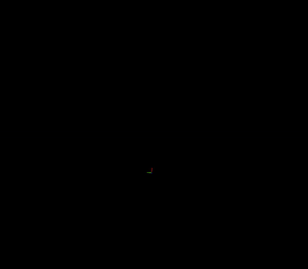

<div align="center">
  <h1>Liorf + Distributed SOLiD </h1>
  <a href=""></a>
  <a href=""></a>
  <a href=""></a>
  <a href=""></a>
  <a href=""></a>
  <br />
  <br />

  <p align="center">
    
  </p>

</div>

## :open_file_folder: What is Distributed SOLiD SLAM?
* Distributed SOLiD SLAM is a Distributed SOLiD-based LiDAR SLAM Framework, which is a modified version of [Liorf](https://github.com/YJZLuckyBoy/liorf) and [DiSCo-SLAM](https://github.com/RobustFieldAutonomyLab/DiSCo-SLAM). ([Scan Context](https://github.com/gisbi-kim/scancontext.git) &rightarrow; [SOLiD](https://github.com/sparolab/solid.git))
* The information exchange between robots is made through ROS-based communication. (More detailed in [here](https://github.com/sparolab/Distributed-SOLiD-SLAM/blob/main/msg/context_info.msg)!!)
* SOLiD, which is a lightweight descriptor enables fast communication between robots.

## :package: Dependencies
* Ubuntu 20.04
* [GTSAM (Develop version)](https://github.com/borglab/gtsam.git)
* [libnabo 1.0.7](https://github.com/norlab-ulaval/libnabo/tree/1.0.7)


## HOW to run the package
0. follow the setup required for liorf package and DiSCO-SLAM (mostly implemented)
   
1. Run the launch file:
  ```
    roslaunch liorf run_liorf_multi.launch
  ```

2. Play existing bag files:
  ```
    rosbag play your_bag.bag
  ```

 <p align='center'>
      
  </p>


**DiSCo-SLAM without Local SLAM enhancement:**
   prone to odometry drift in sudden environment changes
 <p align='center'>
      
  </p>


**After Local SLAM enhancement(with Liorf as LOCAL SLAM):**
   robust to drift and sudden environment changes
 <p align='center'>
      
  </p>


## :open_file_folder: What is Distributed SOLiD SLAM?
* Distributed SOLiD SLAM is a Distributed SOLiD-based LiDAR SLAM Framework, which is a modified version of [LIO-SAM](https://github.com/yeweihuang/LIO-SAM) and [DiSCo-SLAM](https://github.com/RobustFieldAutonomyLab/DiSCo-SLAM). ([Scan Context](https://github.com/gisbi-kim/scancontext.git) &rightarrow; [SOLiD](https://github.com/sparolab/solid.git))
* The information exchange between robots is made through ROS-based communication. (More detailed in [here](https://github.com/sparolab/Distributed-SOLiD-SLAM/blob/main/msg/context_info.msg)!!)
* SOLiD, which is a lightweight descriptor enables fast communication between robots.


## 
- Here we provide a distributed multi-robot SLAM example for 3 robots, intended for use with the two datasets provided below.
- Code from [Scan Context](https://github.com/irapkaist/scancontext) is used for feature description.
- We use code from [PCM](https://github.com/lajoiepy/robust_distributed_mapper/tree/d609f59658956e1b7fe06c786ed7d07776ecb426/cpp/src/pairwise_consistency_maximization) 
for outlier detection.


## Dependencies
- [gtsam 4.0.2](https://github.com/borglab/gtsam/releases) (Georgia Tech Smoothing and Mapping library)
- Dependency for [Scan Context](https://github.com/irapkaist/scancontext):
  - [libnabo 1.0.7](https://github.com/ethz-asl/libnabo/releases)
  
## Datasets

- [The Park Dataset](https://drive.google.com/file/d/1-2zsRSB_9ORQ9WQdtUbGdoS4YXU3cBQt/view?usp=sharing)
- [KITTI 08 Dataset](https://drive.google.com/file/d/1U6z_1VHlPJa_DJ2i8VwxkKLjf5JxMo0f/view?usp=sharing)

To run the KITTI08 dataset, change line 9 & 10 in launch/run.launch from
  ```
<rosparam file="$(find lio_sam)/config/params.yaml" command="load" />
<rosparam file="$(find lio_sam)/src/DiSCo-SLAM/config/mapfusion.yaml" command="load"/>
  ```
to
  ```  
<rosparam file="$(find lio_sam)/config/params_k.yaml" command="load" />
<rosparam file="$(find lio_sam)/src/DiSCo-SLAM/config/mapfusion_k.yaml" command="load"/>
  ```
DiSO FEATURES
---------------------------------------------------------------------------------------------------------------------------------------------------
- Now utilizes G-ICP for mapFusion node, for better map-to-map matching

- republish of map topics for 3rd-party application requiring map application


LIORF FEATURES
---------------------------------------------------------------------------------------------------------------------------------------------------
# New Feature
------------------- Update Date: 2022-11-20 -------------------
- This version has removed the feature extraction module, making it easier to adapt to different lidars;
  
- Support 'robosense' lidar and Mulran datasets, make the following changes in "*.yaml":
  - sensor: “robosense” or sensor: “mulran”

- Support 6-axis IMU, make the following changes in "*.yaml":
  - imuType: 0 # 0: 6-axis IMU, 1: 9-axis IMU

- Support low frequency IMU（50HZ、100HZ）, make the following changes in "*.yaml":
  - imuRate: 500

------------------- Update Date: 2022-12-13 -------------------
- Re-derivation the LM optimization, don't need coordinate transformation.

------------------- Update Date: 2022-12-24 -------------------
- Modified gps factor, no longer depending on the 'robot_localization' package, and make it easier to adapt to different gnss device(RTK/GPS).

- The gps factor is modified to make it easier to adapt to gnss devices with different frequencies(10HZ~500HZ).

---------------------------------------------------------------------------------------------------------------------------------------------------


## For fusion gps factor
- Make sure your gnss topic type is 'sensor_msgs::NavSatFix';

- Modify 'gpsTopic' paramter in '*.yaml' with yourself gnss topic;
  ```
    gpsTopic: "gps/fix"    # GPS topic
  ```
- If you want to use liorf with integrated gps factor in kitti dataset, you can use the modified python script in "config/doc/kitti2bag" to obtain high-frequency gps data(Rate: 100HZ, Topic: '/gps/fix/correct'). About how to use "kitti2bag.py", please refer to [doc/kitti2bag](https://github.com/TixiaoShan/LIO-SAM/tree/master/config/doc/kitti2bag).


## Issues

  - **Zigzag or jerking behavior**: if your lidar and IMU data formats are consistent with the requirement of LIO-SAM, this problem is likely caused by un-synced timestamp of lidar and IMU data.

  - **Jumpping up and down**: if you start testing your bag file and the base_link starts to jump up and down immediately, it is likely your IMU extrinsics are wrong. For example, the gravity acceleration has negative value.

  - **mapOptimization crash**: it is usually caused by GTSAM. Please install the GTSAM specified in the README.md. More similar issues can be found [here](https://github.com/TixiaoShan/LIO-SAM/issues).

  - **gps odometry unavailable**: it is generally caused due to unavailable transform between message frame_ids and robot frame_id (for example: transform should be available from "imu_frame_id" and "gps_frame_id" to "base_link" frame. Please read the Robot Localization documentation found [here](http://docs.ros.org/en/melodic/api/robot_localization/html/preparing_sensor_data.html).


