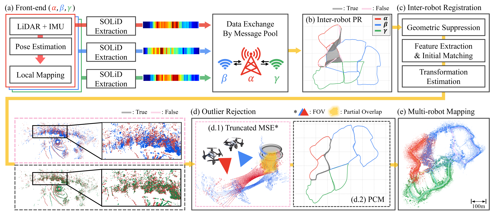

  <h1>SKiD-SLAM</h1>
  
  
  
  
  
  
  
   
   

  

    
  

  
<strong><em>[Stay Tuned!!] Robust, Lightweight, and Distributed Multi-Robot LiDAR SLAM</em></strong>

______________________________________________________________________

## News
* [25.04.29] Our paper has been selected for a spotlight talk! 
* [25.04.17] Our paper is accepted at the IEEE International Conference on Robotics and Automation (ICRA) 2025 Field Robotics Workshop.
* [25.03.30] Our code for SKiD-SLAM will be available after the review process.
* [25.03.30] We submit our paper to the IEEE International Conference on Robotics and Automation (ICRA) 2025 Field Robotics Workshop.

## Paper
* **Title**: SKiD-SLAM: Resource-Aware Distributed Multi-Robot LiDAR SLAM for Planetary Missions with Field Deployments at Analog Sites
