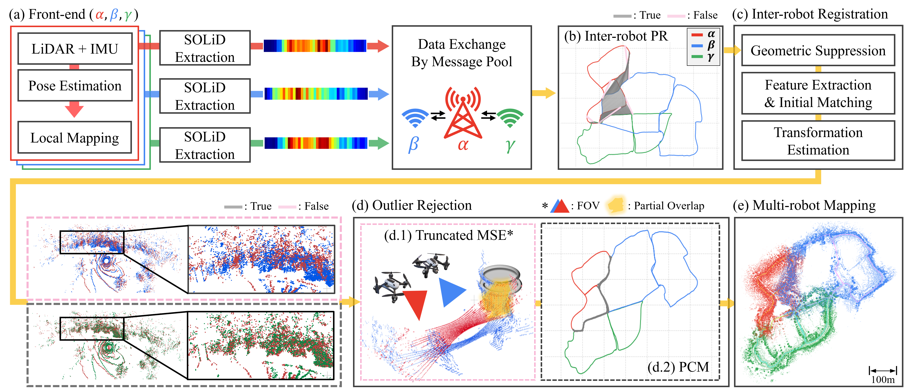

  <h1>SKiD-SLAM</h1>
  
  
  
  
  
  
  
   
   

  

    
  

  
<strong><em>Robust, Lightweight, and Distributed Multi-Robot LiDAR SLAM</em></strong>

______________________________________________________________________

# News
* We submit our paper to the IEEE International Conference on Robotics and Automation (ICRA) 2025 Workshop.
* Code for SKiD-SLAM will be available after the review process.

# Contributing

